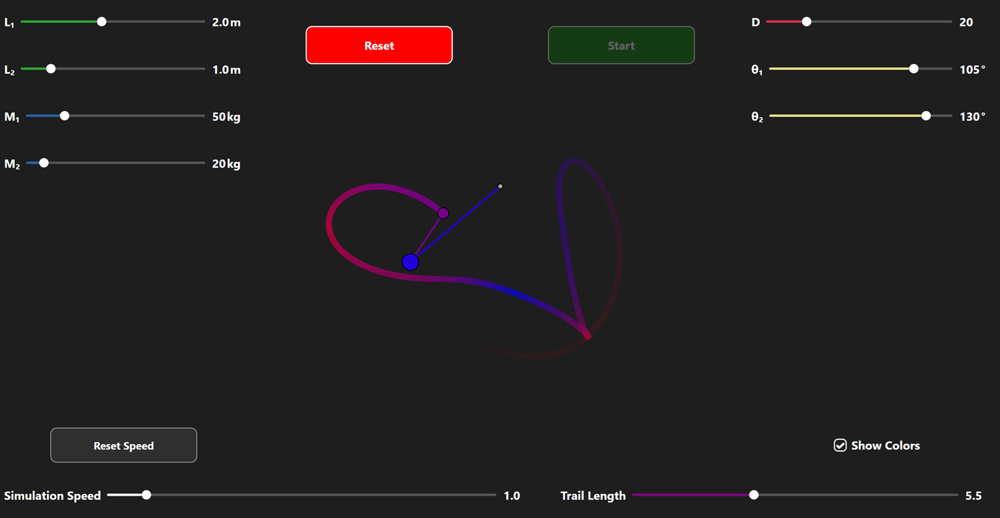

[](https://github.com/luniphys/double-pendulum/actions/workflows/ci.yml)
[](LICENSE)
[](https://learn.microsoft.com/en-us/dotnet/csharp/)


# Double Pendulum

A WPF desktop application that simulates a double pendulum in real time. The physics are solved numerically using a 4th-order Runge-Kutta integrator. Pendulum parameters (arm lengths, masses, initial angles, damping), simulation speed as well as the trail length can be adjusted interactively via sliders.

<p align="center">
    
</p>


## Table of Contents

- [Overview](#overview)
- [Features](#features)
- [Requirements](#requirements)
- [Build & Run](#build--run)
- [Testing](#testing)
- [Project Structure](#project-structure)
- [Mathematics](#mathematics)
- [License](#license)


## Overview

The double pendulum is a classical example of a chaotic dynamical system. Small differences in initial conditions lead to vastly different trajectories over time. This application lets you explore that behaviour interactively by configuring the physical parameters of the system and watching the simulation evolve in real time.

The simulation pipeline is:

1. Sets physical parameters, simulation speed and trail length via sliders.
2. At each frame, the physics engine advances the state by integrating the equations of motion using **RK4**.
3. The renderer converts the polar state $(\theta_1, \theta_2)$ to Cartesian coordinates and draws the pendulum on a WPF canvas.
4. Reset pendulum for launching with different parameters.


## Features

- Real-time simulation with configurable step size
- Adjustable arm lengths, masses, initial angles, damping coefficient, simulation speed and trail length
- Switchable colorization of the individual pendulums and its trail depending on their angular velocity


## Requirements

- Windows
- [.NET 10 SDK](https://dotnet.microsoft.com/download)


## Build & Run

Clone the repository and run the application from the solution root:

```sh
git clone https://github.com/luniphys/double-pendulum.git
cd double-pendulum
dotnet run --project src/double-pendulum
```

To build without running:

```sh
dotnet build
```


## Testing

Run the full test suite from the solution root:

```sh
dotnet test
```

Tests are written with **xUnit** and cover:

- State initialisation
- Derivative calculation
- Runge-Kutta 4th-order integration
- Simulation step updates
- Coordinate transformation
- Physical properties: pendulum at rest stays at rest, energy conservation with and without damping


## Project Structure

```
src/double-pendulum/    # WPF application and physics backend
tests/                  # xUnit unit tests
docs/                   # Documentation assets
```


## Mathematics

The double pendulum is described by two coupled, nonlinear second-order differential equations (Lagrangian mechanics). An optional linear damping term $b$ is included to model energy dissipation.

### Equations of Motion

$$
(m_1 + m_2) l_1 \ddot{\theta}_1 + m_2 l_2 \ddot{\theta}_2 \cdot \cos(\theta_1 - \theta_2) + m_2 l_2 \dot{\theta}_2^2 \cdot \sin(\theta_1 - \theta_2) + (m_1 + m_2) g \cdot \sin(\theta_1) + b \dot{\theta}_1 = 0
$$

$$
m_2 l_2 \ddot{\theta}_2 + m_2 l_1 \ddot{\theta}_1 \cdot \cos(\theta_1 - \theta_2) - m_2 l_1 \dot{\theta}_1^2 \cdot \sin(\theta_1 - \theta_2) + m_2 g \cdot \sin(\theta_2) + b \dot{\theta}_2 = 0
$$

### State Vector Formulation

The system state is represented as a vector of angles and angular velocities:

```math
$$
\vec{y} = (\theta_1, \theta_2, \omega_1, \omega_2)^T
$$
```

This allows the two second-order equations to be rewritten as a first-order system:

```math
$$
\dot{\vec{y}} = \begin{pmatrix} \dot{\theta}_1 \\ \dot{\theta}_2 \\ \ddot{\theta}_1 \\ \ddot{\theta}_2 \end{pmatrix} = \begin{pmatrix} \omega_1 \\ \omega_2 \\ g_1(\theta_1, \theta_2, \omega_1, \omega_2) \\ g_2(\theta_1, \theta_2, \omega_1, \omega_2) \end{pmatrix} = \vec{f}(\theta_1, \theta_2, \omega_1, \omega_2)
$$
```

### Solving for Angular Accelerations

The angular accelerations $(\ddot{\theta}_1, \ddot{\theta}_2)$ are obtained by solving the linear system:

```math
$$
\begin{pmatrix} (m_1 + m_2) l_1 & m_2 l_2 \cdot \cos(\theta_1 - \theta_2) \\ m_2 l_1 \cdot \cos(\theta_1 - \theta_2) & m_2 l_2 \end{pmatrix} \cdot \begin{pmatrix} \ddot{\theta}_1 \\ \ddot{\theta}_2 \end{pmatrix} = \begin{pmatrix} -m_2 l_2 \omega_2^2 \cdot \sin(\theta_1 - \theta_2) - (m_1 + m_2) g \cdot \sin(\theta_1) - b \omega_1 \\ m_2 l_1 \omega_1^2 \cdot \sin(\theta_1 - \theta_2) - m_2 g \cdot \sin(\theta_2) - b \omega_2 \end{pmatrix}
$$
```

```math
$$
A \cdot \begin{pmatrix} \ddot{\theta}_1 \\ \ddot{\theta}_2 \end{pmatrix} = C \iff \begin{pmatrix} \ddot{\theta}_1 \\ \ddot{\theta}_2 \end{pmatrix} = A^{-1} \cdot C
$$
```

### Numerical Integration — Runge-Kutta 4th Order

The state is advanced in time using the classical RK4 method, which provides 4th-order accuracy per step:

$$
\vec{y}_{i+1} = \vec{y}_i + \frac{h}{6} \cdot \left(\vec{\kappa_0} + 2 \vec{\kappa_1} + 2 \vec{\kappa_2} + \vec{\kappa_3} \right)
$$

$$
\vec{\kappa}_0 = \vec{f} \left(\vec{y}_i \right), \quad \vec{\kappa}_1 = \vec{f} \left(\vec{y}_i + \frac{h}{2} \cdot \vec{\kappa}_0 \right), \quad \vec{\kappa}_2 = \vec{f} \left(\vec{y}_i + \frac{h}{2} \cdot \vec{\kappa}_1 \right), \quad \vec{\kappa}_3 = \vec{f} \left(\vec{y}_i + h \cdot \vec{\kappa}_2 \right)
$$

where $h$ is the step size between consecutive time stamps $t_i$ and $t_{i+1}$.


## License

MIT © [luniphys](https://github.com/luniphys)
